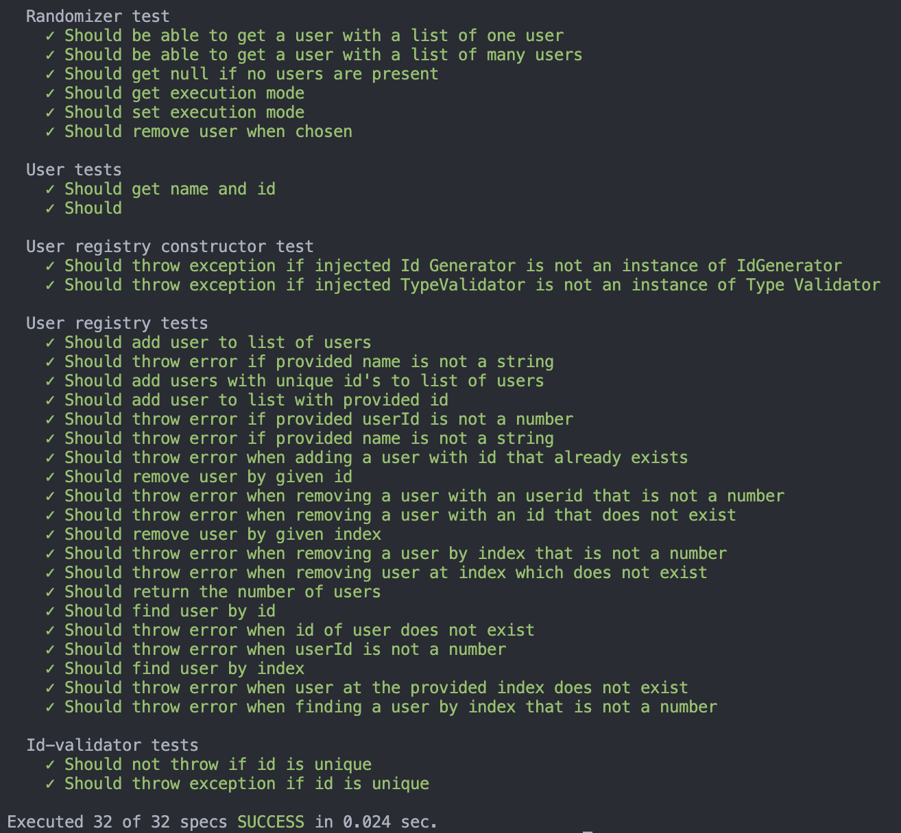

# Mall för inlämning laboration 1, 1dv610

​

## Checklista

- [x] Jag har skrivit all kod och reflektioner själv. Jag har inte använt mig av andras kod för att lösa uppgiften.
- [x] Mina testresultat är skrivna utifrån utförd testning ( och inte teoretiskt: "det bör fungera" :) )
- [x] Koden är objektorienterad
- [x] Jag har skrivit en modul som riktar sig till programmerare
      ​

## Egenskattning och mål

- [ ] Jag är inte klar eftersom jag vet att jag saknar något. (Då skall du inte lämna in! Lämna då istället in på restlaboration.)
- [ ] Jag eftersträvar med denna inlämning godkänt betyg (E-D)
  - [x] De flesta testfall fungerar
  - [x] Koden är förberedd på Återanvändning
  - [x] All kod samt historik finns i git
  - [x] Kodkvaliterskraven är ifyllda
  - [x] Reflektion är skriven utifrån bokens kapitel
- [ ] Jag eftersträvar med denna inlämning högre betyg (C-B) och anser mig uppfylla alla extra krav för detta.
  - [x] Samtliga testfall är skrivna
  - [x] Testfall är automatiserade
  - [x] Det finns en tydlig beskrivning i hur modulen skall användas (i git)
  - [x] Kodkvalitetskraven är varierade
- [x] Jag eftersträvar med denna inlämning högsta betyg (A)
      ​
      Förtydligande: Examinator kommer sätta betyg oberoende på vad ni anser.
      ​

## Återanvändning

Se [Readme](./readme.md).
​

## Beskrivning av min kod

Detta projekt består av ett bibliotek där det går att skapa en lista av användare och där biblioteket kan slumpa fram en användare av de som matats in. Det går också att konfigurera att en användare ska tas bort från användarresgistret ifall den en gång har slumpats fram. I detta projekt finns också en "test-app" där automatiska enhetstester för biblioteket finns lagrade.
​

## Hur jag testat

Jag har använt en stor samling enhetstester som, enligt mig, testar samtliga utfall av koden.
​

### Testfall

​
​

## Kodkvalitetskrav

### Namngivning

| ​                          | Namn och förklaring                                                                                                                                                                                                                                                                                                                                                                                                                                                 | Reflektion och regler från Clean Code |
| -------------------------- | ------------------------------------------------------------------------------------------------------------------------------------------------------------------------------------------------------------------------------------------------------------------------------------------------------------------------------------------------------------------------------------------------------------------------------------------------------------------- | ------------------------------------- |
| UserRandomizer             | **Class Names** - Namn på klasser ska vara substantiv och inte ett verb. **Use Problem Domain Names** - User och Randomizer pekar på att domänen vi rör oss i har med användare och slumpgenerering att göra.                                                                                                                                                                                                                                                       |
| addUser                    | **Use Pronounceable Names** - Går lätt att uttala. **Method Names** - Metoder på klasser ska vara verb                                                                                                                                                                                                                                                                                                                                                              |
| addUserWith                | **Add Meaningful Context** - Eftersom att vi rör oss i ett otypat språk så indikerar vi är att vi kan lägga till en användare med + "vissa egenskaper". Kräver ju dock att vi faktiskt läser kommentarerna kring funktionen vilket kanske inte är bra bra. Denna konvention passar kanske bättre i ett typat språk. Tycker inte att boken tar upp skillander på hur funktionnamn ska skrivar beroende på typat eller otypat språk vilket enligt mig hade varit bra. |
| shouldRemoveUserWhenChosen | **Pick One Word Per Concept** - Här blandar vi plötsligt in "chosen" när vi tidigare använt begreppet "random". Det hade varit bättre att använda det för att undvika det boken kallar **Avoid Mental Mapping**                                                                                                                                                                                                                                                     |
| getExecutionMode           | **Use Problem Domain Names** - Domänen vi rör oss är användare och slumpgenerering men här blandar vi även in "ExecutionMode" och vad är detta egentligen? Hade varit bättre att följa det boken menar med **Method Names** och följa "is"+nånting för att peka på att vi får en klassvariabel som kan vara true eller false. Exempelvis isRemovingUserWhenRandomlyChosen eller liknande som också nämns under **Use Intention Revealing Names**                    |

​

### Funktioner

​
| Metodnamn | Antal rader | Reflektion |
| ----------------- | ----------- | -------------------------------------------------------------------------------------------------------------------------------------------------------------------------------------------------------------------------------------------------------------------------------------------------------------------------------------------------------------------------------------------------------------------------------------------------------------------------------------------------------------------------------------------------------------------------------------------------------------------- |
| CreateUserWith | 5 | Vi har här en **Dyadic Function** då vi skickar in två argument till funktionen. Här hade det varit bättre att istäället skicka in ett objekt med dessa värden (**Argument Objects**) och då hade vi nog inte ens behövt funktionen createUser då vi kunnat använda denna helt enkelt istället. |
| getRandomUser | 9 | **Have No Side Effects** - Här tar vi ju också bort en användare ifall vi ställt in programmet att göra så. Det går ju att diskutera om det är en "sidoeffekt" av denna funktion. Detta bryter ju också lite mot **Command Query Separation** då vi ibland tar bort en användare och svarar "alltså utför en query" mot något. |
| findUserByIndex | 6 | Funktionens namn är ett verb och talar tydligt o vad den gör i enlighet med **Verbs and Keywords**. Däremot använder den ju "Index" både i funktionens namn samt i namnet på argumentet. Det här bör då bestämmas i enlighet med **Use Descriptive Names** och helt enkelt göra likadant på alla ställen om det finns fler ställen detta mönster förekommer. Funktionen kanske är lite lång då den letar i en array och kastar fel. Just den biten hade kunnat vara en egen funktion för att komma närmare devisen **Do One Thing** genom att funktionen hittar en användare utifrån index men bryr sig inte om hur. |
| removeUserBy | 6 | I princip samma som ovan förutom att vi inte har döpt den till "removeUserByUserId(userId)" om vi hade följt samma namngivning som ovan. Funktionen är lkanske ite lång och bryter därmed mot devisen **Small!**. DEn letar ju också i en array två gånger och kastar fel en gång vilket också tyder på att den bryter lite mot **Do One Thing**. |
| removeUserByIndex | 5 | Här tycker jag ändå att funktionens längd når inom **Small!** då den är 5 rader. Längre än så ska nog helst undvikas. Vi kastar också fel vilket föredras istället för **Prefer Exceptions to Returning Error Codes** Vi använder oss också av **Common Monadic Form** då vi endast har ett argument till funktionen. |
​

## Laborationsreflektion

Det jag saknade är som sagt ifall namngivningen skiljer sig mellan typade och otypade språk och ifall det är viktigt eller inte att skriva ex. jsdoc-kommentarer i otypade språk för att informera om typerna. Som vanligt tycker jag böckerna missar att förklara vad en "domän" är. Det tog mig flera år innan jag förstod vad som menades med det ävenf ast det är världens enklaste sak. Alltså verksamheten som koden avspeglar sig mot. Något som jag upptäckt i min egen kod är att jag inte validerar typerna som skickas in i just mina validatorer. Jag vet inte ens om det är möjligt att åstadkomma om jag ska vara ärlig.  
Uncle Bob och hans böcker är lika kända som GOF så att ha denna bok som kursbok lämpar sig mycket väl!
